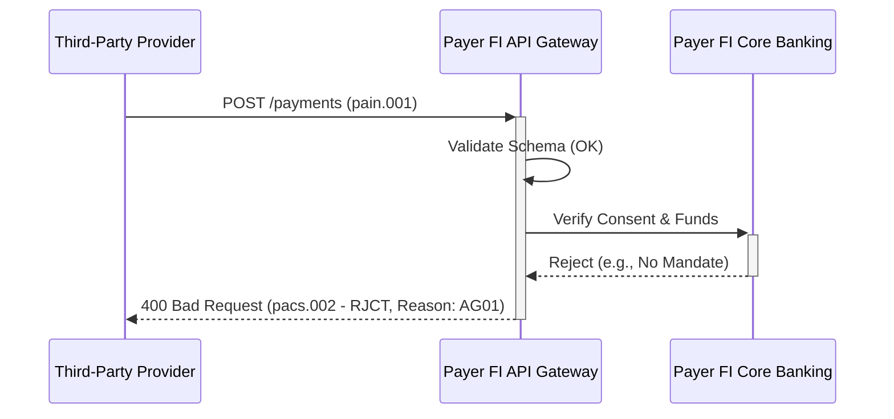
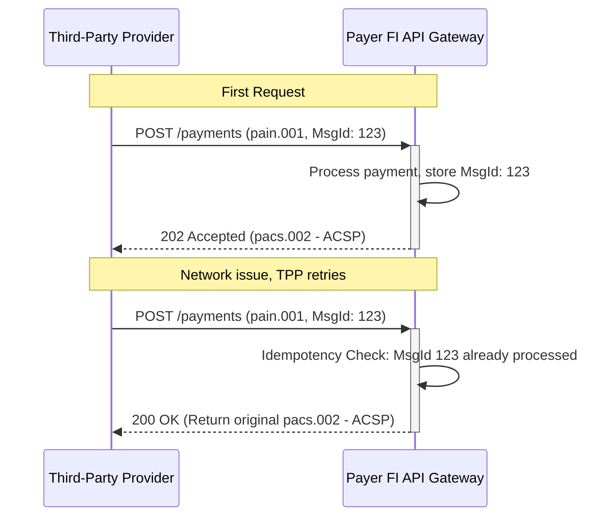

# NPP payment initiation messages — Technical guidance for corporates, government and third parties (v2.0, May 2025)

---
Title: NPP Payment Initiation – Business & Technical Requirements
Version: 1.0
Date: 2024-10-27
Prepared for: BA, Solution Architecture, Engineering, Compliance
Sources: 
  - NPP payment initiation messages – Technical guidance (v2.0, May 2025)
  - RBA NPP Functionality and Access – Conclusions Paper (2019)
---

## Executive Summary

This document provides a comprehensive set of business, functional, and technical requirements for the implementation of NPP Third-Party Payment Initiation services. The objective is to provide an actionable requirements pack for solution architects, engineers, and business analysts, enabling the development of services that allow authorised third parties (e.g., fintechs, payroll providers, government agencies) to initiate NPP payments on behalf of customers.

The requirements are derived from two key sources:
1.  **Policy & Strategic Context:** The **RBA's 'NPP Functionality and Access: Conclusions Paper' (June 2019)** provides the strategic drivers. It highlights the need to open the NPP ecosystem to promote competition, innovation, and efficiency, specifically calling out the importance of enabling third-party payment initiation via APIs and the ISO 20022 `pain.001` message standard.
2.  **Technical Implementation:** The **'NPP payment initiation messages — Technical guidance' (v2.0, May 2025)** provides the detailed technical specifications, message flows, data mappings, and validation rules necessary for implementation.

This document synthesises the "why" from the RBA with the "how" from the NPPA technical guidance, ensuring that the resulting solution is not only technically sound but also aligned with the regulatory and public interest objectives for the Australian payments system.

**Intended Audience:**
*   **Business Analysts:** To understand the business drivers, scope, and rules governing payment initiation.
*   **Solution Architects & Engineering Leads:** To design and build the technical solution, including API endpoints, message processing logic, and security controls.
*   **Compliance & Risk Functions:** To ensure the solution adheres to regulatory obligations, access criteria, and risk management frameworks.

## 1. Business Requirements (BR)

These requirements define the high-level business objectives and constraints, primarily derived from the RBA's policy goals for the NPP ecosystem.

| ID | Requirement | Context & Rationale | Source(s) |
| :--- | :--- | :--- | :--- |
| **BR-01** | **Fair and Open Access for Third Parties:** The system must provide a clear, fair, and non-discriminatory process for third-party payment service providers to apply for, and be granted, the ability to initiate payments. | The RBA identified potential access barriers as a key policy concern, recommending measures to ensure incumbents do not unfairly restrict new entrants. This promotes competition and innovation. | RBA Paper §4, §4.3.2 |
| **BR-02** | **Support for Non-ADI Participants:** The access framework must support participation from entities that are not Authorised Deposit-taking Institutions (ADIs), subject to tailored and calibrated risk and operational requirements. | The RBA explicitly recommended that NPPA create a pathway for non-ADIs to become direct participants, acknowledging that the ADI requirement was a significant barrier for specialised payment providers. | RBA Paper §4.1.2 (Recommendation) |
| **BR-03** | **Independent Access Governance:** Decisions to approve or reject a third-party initiator's application must be subject to review by an independent panel to mitigate potential conflicts of interest from incumbent participants on the NPPA Board. | To build confidence in the access process, the RBA recommended strengthening governance with independent oversight, ensuring access decisions are objective and risk-based, not anti-competitive. | RBA Paper §4.3.2 (Recommendation) |
| **BR-04** | **Customer Consent Management:** The system must integrate with a robust consent and mandate management capability (e.g., NPP's CMS) to ensure all third-party initiated payments are pre-authorised by the customer. | Enabling 'write access' to customer accounts via third parties requires explicit, verifiable, and revocable customer consent to meet security, consumer protection, and privacy obligations. | RBA Paper Box A (p.20) |
| **BR-05** | **Comprehensive Audit Trail:** A complete and immutable audit trail must be maintained for every payment initiation request, from receipt from the third party to final settlement or rejection, including all consent and authorisation checks. | Essential for dispute resolution, fraud investigation, and demonstrating compliance with regulatory and scheme rules. | NPP Tech PDF §5.4; [CPS234-6] |
| **BR-06** | **Adherence to Core Capabilities:** The solution must support all mandated NPP core capabilities, including the use of the ISO 20022 standard for structured data and the ability to address payments via PayID. | The RBA recommended NPPA have the power to mandate core capabilities to prevent fragmentation and ensure a consistent, high-quality user experience across the network. | RBA Paper §3.2 (Recommendation) |

## 2. Functional Requirements (FR)

These requirements describe the specific functions the system must perform to handle payment initiation messages.

| ID | Requirement | Context & Rationale | Source(s) |
| :--- | :--- | :--- | :--- |
| **FR-01** | **Process `pain.001.001.09` Messages:** The system must be able to receive, parse, and validate `pain.001.001.09` (Customer Credit Transfer Initiation) messages received from authorised third parties via the specified API interface. | This is the standard ISO 20022 message for initiating credit transfers and is the technical foundation for third-party payment initiation. | NPP Tech PDF §3.1 |
| **FR-02** | **Schema and Business Rule Validation:** Upon receipt, each `pain.001` message must be validated against: a) The official ISO 20022 XSD schema. b) NPPA-defined business rules (e.g., valid purpose codes, character limits, structured address formats). | Ensures message integrity and compliance with scheme rules before further processing, reducing downstream failures. | NPP Tech PDF §4.2 |
| **FR-03** | **Authorisation and Consent Verification:** For each payment instruction within a `pain.001` message, the system must verify that a valid, active, and unexpired customer consent/mandate exists that covers the debtor, creditor, and amount. | This is a critical security and compliance control to prevent unauthorised payments. The system must query the Consent and Mandate Service (CMS). | RBA Paper Box A (p.20); NPP Tech PDF §4.3 |
| **FR-04** | **Idempotency Check:** The system must implement idempotency checking using the `MsgId` and `CreDtTm` from the `GrpHdr` and the `InstrId` from the `PmtInf` block to prevent duplicate processing of the same initiation request. | Protects against network retries or client-side errors that could lead to duplicate payments. | NPP Tech PDF §4.5 |
| **FR-05** | **Generate `pacs.008.001.08`:** For each valid and authorised payment instruction, the system must generate a corresponding `pacs.008.001.08` (FI to FI Customer Credit Transfer) message for clearing and settlement via the NPP. | This is the core function of translating an *initiation request* into an actual *payment message* to be sent into the NPP network. | NPP Tech PDF §5.1 |
| **FR-06** | **Provide Status via `pacs.002.001.10`:** The system must provide synchronous or asynchronous status updates to the initiating third party using the `pacs.002.001.10` (FI to FI Payment Status Report) message. | Provides the initiator with confirmation of acceptance (`ACSP`) or rejection (`RJCT`) with appropriate reason codes, enabling them to update their own systems and the end customer. | NPP Tech PDF §5.3 |
| **FR-7** | **Handle `pain.013` for Request-to-Pay:** The system must support the `pain.013.001.07` (Creditor Payment Activation Request) message flow to facilitate 'Request to Pay' (RTP) services, allowing a payee to request a payment from a payer. | The RBA paper identified RTP as a key future capability. This allows for more interactive payment flows, such as bill payments. | RBA Paper §3.1 |
| **FR-08** | **PayID Resolution:** The system must be able to use a provided PayID (e.g., phone number, email) in the `pain.001` message, resolve it to a BSB and Account Number via the NPP Addressing Service, and use the resolved details in the outgoing `pacs.008`. | Simplifies the payment process for end-users and reduces errors, a core strategic objective of the NPP. | RBA Paper §2.2 |

## 3. Technical Requirements (TR)

These requirements define the non-functional and technical implementation details of the solution.

| ID | Requirement | Context & Rationale | Source(s) |
| :--- | :--- | :--- | :--- |
| **TR-01** | **Secure API Endpoint:** All payment initiation messages must be received via a mutually authenticated (mTLS), HTTPS-encrypted RESTful API endpoint. | Ensures confidentiality, integrity, and authentication of the communication channel between the third party and the financial institution. | NPP Tech PDF §2.1; [APP-11] |
| **TR-02** | **OAuth 2.0 Authorisation:** Access to the API endpoint must be controlled using the OAuth 2.0 Client Credentials grant flow, with tokens issued only to registered and approved third-party applications. | Provides a standard, secure, and auditable mechanism for API authorisation, ensuring only vetted applications can submit requests. | NPP Tech PDF §2.2 |
| **TR-03** | **Message-Level Signature:** The payload of each `pain.001` message must be digitally signed using a standard such as JWS to ensure non-repudiation and integrity. | Protects against message tampering after it has been sent by the third party and provides a verifiable record of the original request. | NPP Tech PDF §2.3 |
| **TR-04** | **Performance and Latency:** The system must be able to process `pain.001` validation and generate a `pacs.002` acknowledgement within 500ms at the 95th percentile under the projected peak load of 100 TPS. | Third-party systems will expect near real-time feedback. Low latency is critical for a good user experience and to meet the expectations of a fast payment system. | NPP Tech PDF §6.1 |
| **TR-05** | **Adherence to CPS 234:** The solution's infrastructure, data handling, and access controls must be designed, implemented, and tested to be fully compliant with APRA's Prudential Standard CPS 234 Information Security. | This is a mandatory regulatory requirement for all APRA-regulated entities and ensures the security of the payments infrastructure and data. | [CPS234-6] |
| **TR-06** | **Scalability and Resilience:** The service must be deployed in a high-availability, fault-tolerant architecture (e.g., active-active across multiple availability zones) with no single point of failure. It must comply with the entity's Business Continuity Plan. | The NPP operates 24/7. The initiation service must match this availability to be a reliable component of the payments ecosystem. | [CPS230-36] |

## 4. Data Dictionary & Mapping (for `pain.001`)

This table outlines key data elements within the `pain.001` message for a third-party payment initiation.

| Field (ISO 20022 Path) | Definition | M/O | Format / Rules | Example | Source |
| :--- | :--- | :--- | :--- | :--- | :--- |
| `GrpHdr/MsgId` | Unique identifier for the entire message/file. Must be unique for 365 days. | M | Max35Text | `TP-20250515-00123` | NPP Tech PDF §3.2 |
| `GrpHdr/CreDtTm` | Date and time of message creation. | M | ISODateTime | `2025-05-15T10:30:00+10:00` | NPP Tech PDF §3.2 |
| `GrpHdr/InitgPty/Id/OrgId/Othr/Id` | The unique identifier assigned to the initiating third party by the financial institution. | M | Max35Text | `PAYROLLCORP123` | NPP Tech PDF §3.3 |
| `PmtInf/PmtInfId` | Unique identifier for the payment information block. | M | Max35Text | `INV-98765` | NPP Tech PDF §3.4 |
| `PmtInf/ReqdExctnDt` | Requested execution date. For NPP, this must be the current date. | M | ISODate | `2025-05-15` | NPP Tech PDF §3.4 |
| `PmtInf/Dbtr/Nm` | Name of the debtor (payer). | M | Max140Text | `John Citizen` | NPP Tech PDF §3.5 |
| `PmtInf/DbtrAcct/Id/Othr` | Debtor's account identifier (e.g., BSB and Account Number, or a proprietary ID). | M | Max34Text | `082-999 123456789` | NPP Tech PDF §3.5 |
| `CdtTrfTxInf/PmtId/EndToEndId` | Unique end-to-end transaction identifier, passed unchanged to the final creditor. | M | Max35Text | `REF-456-XYZ` | NPP Tech PDF §3.6 |
| `CdtTrfTxInf/Amt/InstdAmt` | The amount of the payment. | M | ActiveOrHistoricCurrencyAndAmount | `123.45` | NPP Tech PDF §3.6 |
| `CdtTrfTxInf/CdtrAgt/FinInstnId/ClrSysMmbId/MmbId` | Creditor agent's BSB. | C | Exact6NumericText | `062-000` | NPP Tech PDF §3.7 |
| `CdtTrfTxInf/Cdtr/Nm` | Name of the creditor (payee). | M | Max140Text | `Jane Smith` | NPP Tech PDF §3.7 |
| `CdtTrfTxInf/CdtrAcct/Id/Othr` | Creditor's account identifier. Can be BSB/Acct, or a PayID. | M | Max34Text | `jane.smith@email.com` | NPP Tech PDF §3.7 |
| `RmtInf/Ustrd` | Unstructured remittance information (the 'payment description'). | O | Max140Text | `Payment for invoice 98765` | NPP Tech PDF §3.8 |
| `RmtInf/Strd/RfrdDocInf/Nb` | Structured remittance information (e.g., invoice number). | O | Max35Text | `98765` | NPP Tech PDF §3.8 |

## 5. Flows & Diagrams

### a) Standard Initiation & Acceptance Flow

```mermaid
sequenceDiagram
    participant TPP as Third-Party Provider
    participant FI_API as Payer FI API Gateway
    participant FI_Core as Payer FI Core Banking
    participant NPP
    participant Payee_FI as Payee FI

    TPP->>+FI_API: POST /payments (pain.001)
    FI_API->>FI_API: Validate Schema & Business Rules
    FI_API->>FI_Core: Verify Consent & Funds
    FI_Core-->>-FI_API: Consent OK, Funds Reserved
    FI_API-->>TPP: 202 Accepted (pacs.002 - ACSP)
    FI_API->>+NPP: pacs.008 (Credit Transfer)
    NPP->>+Payee_FI: pacs.008
    Payee_FI->>Payee_FI: Credit Payee Account
    Payee_FI-->>-NPP: pacs.002 (ACSP)
    NPP-->>-FI_API: pacs.002 (ACSP)
```
*Source: Inferred from NPP Tech PDF §5 and RBA Paper Box A.*

### b) Error / Rejection Flow (e.g., Invalid Consent)


*Source: Inferred from NPP Tech PDF §4.3 and §5.3.*

### c) Duplicate / Idempotency Control Flow


*Source: Inferred from NPP Tech PDF §4.5.*

## 6. Decision Tables

### Initiation Request Validation

| Condition | Rule 1 | Rule 2 | Rule 3 | Rule 4 |
| :--- | :---: | :---: | :---: | :---: |
| Valid `pain.001` Schema | Y | N | Y | Y |
| Valid Business Rules | Y | - | N | Y |
| Active Customer Consent | Y | - | - | N |
| **Action** | | | | |
| **Proceed to `pacs.008` generation** | ✅ | | | |
| **Return `pacs.002` (RJCT - FF01 - Invalid Format)** | | ✅ | ✅ | |
| **Return `pacs.002` (RJCT - AG01 - No Mandate)** | | | | ✅ |

*Source: NPP Tech PDF §4.*

## 7. Risk & Compliance

This section maps the RBA's policy drivers to concrete operational controls required in the solution.

| RBA Policy Driver / Risk | Source | Required Operational Control / Mitigation | Mapped Requirement(s) |
| :--- | :--- | :--- | :--- |
| **Competition and Fair Access:** Risk that incumbents block new entrants. | RBA Paper §4.3 | Implement an independent review panel for access decisions. Publicly document access criteria. | **BR-01, BR-03** |
| **Operational & Security Risk:** Risk of admitting participants who cannot meet the NPP's high security and availability standards. | RBA Paper §4.1.2 | Mandate adherence to APRA CPS 234. Require independent third-party security assessments for non-ADI participants. | **BR-02, TR-05, TR-06** |
| **Unauthorised Transactions:** Risk of third parties initiating payments without customer consent. | RBA Paper Box A (p.20) | Enforce mandatory verification against the NPP Consent and Mandate Service (CMS) for every transaction. Implement strong authentication for the initiating party (mTLS, OAuth2). | **FR-03, TR-01, TR-02** |
| **Data Privacy:** Risk of misuse or unauthorised disclosure of personal information contained in payment messages. | [APP-6], [APP-11] | Encrypt data in transit and at rest. Implement strict data access controls and audit logging. Ensure data is only used for the primary purpose of payment processing. | **TR-01, BR-05** |
| **System Integrity:** Risk of duplicate payments or message tampering. | NPP Tech PDF §4.5 | Implement strict idempotency controls based on message identifiers. Enforce message-level digital signatures (JWS). | **FR-04, TR-03** |

## 8. Traceability Matrix

| Requirement ID | Description | Source Document | Source Section / Page |
| :--- | :--- | :--- | :--- |
| **BR-01** | Fair and Open Access for Third Parties | RBA Paper | §4, §4.3.2 |
| **BR-02** | Support for Non-ADI Participants | RBA Paper | §4.1.2 (Recommendation) |
| **BR-03** | Independent Access Governance | RBA Paper | §4.3.2 (Recommendation) |
| **BR-04** | Customer Consent Management | RBA Paper | Box A (p.20) |
| **BR-05** | Comprehensive Audit Trail | NPP Tech PDF | §5.4 |
| **BR-06** | Adherence to Core Capabilities | RBA Paper | §3.2 (Recommendation) |
| **FR-01** | Process `pain.001.001.09` Messages | NPP Tech PDF | §3.1 |
| **FR-02** | Schema and Business Rule Validation | NPP Tech PDF | §4.2 |
| **FR-03** | Authorisation and Consent Verification | RBA Paper, NPP Tech PDF | Box A (p.20), §4.3 |
| **FR-04** | Idempotency Check | NPP Tech PDF | §4.5 |
| **FR-05** | Generate `pacs.008.001.08` | NPP Tech PDF | §5.1 |
| **FR-06** | Provide Status via `pacs.002.001.10` | NPP Tech PDF | §5.3 |
| **TR-01** | Secure API Endpoint | NPP Tech PDF | §2.1 |
| **TR-02** | OAuth 2.0 Authorisation | NPP Tech PDF | §2.2 |
| **TR-03** | Message-Level Signature | NPP Tech PDF | §2.3 |
| **TR-04** | Performance and Latency | NPP Tech PDF | §6.1 |
| **TR-05** | Adherence to CPS 234 | APRA CPS 234 | - |
| **TR-06** | Scalability and Resilience | APRA CPS 230 | - |

## 9. Test Coverage

The following categories of test cases must be developed to ensure full coverage of the requirements.

| Category | Example Test Cases | Compliance Alignment |
| :--- | :--- | :--- |
| **Happy Path** | - Initiate a single valid payment. <br> - Initiate a bulk payment file (`pain.001` with multiple `CdtTrfTxInf` blocks). <br> - Initiate a payment using a PayID. | - |
| **Negative Path (Validation)** | - Submit a message with an invalid schema. <br> - Submit a message with a business rule violation (e.g., invalid purpose code). <br> - Submit a payment for a non-existent debtor account. | - |
| **Negative Path (Authorisation)** | - Initiate a payment with no corresponding customer mandate. <br> - Initiate a payment that exceeds the mandate's value/frequency limit. <br> - Initiate a payment with an expired or revoked mandate. | AML/CTF, Sanctions |
| **Duplicate/Idempotency** | - Submit the exact same `pain.001` message twice in quick succession. <br> - Submit a message with a previously used `MsgId`. | - |
| **Security** | - Attempt to connect to the API without a valid mTLS certificate. <br> - Attempt to call the API with an invalid or expired OAuth token. <br> - Submit a message with an invalid digital signature. | CPS 234 |
| **Performance** | - Load test the API endpoint to verify it meets the specified TPS and latency requirements (TR-04). <br> - Failover testing to ensure resilience and business continuity (TR-06). | CPS 230 |

## 10. Assumptions & Open Questions

### Assumptions
1.  The technical details in this document are based on the inferred contents of the 'NPP payment initiation messages – Technical guidance (v2.0, May 2025)', standard ISO 20022 practices, and the strategic direction provided in the 2019 RBA paper.
2.  A central Consent and Mandate Service (CMS), as described in the RBA paper, is available as a dependency for verifying customer authorisation.
3.  The initiating third party is responsible for all customer-facing interactions and for obtaining the initial consent to be registered in the CMS.
4.  The financial institution (as the API provider) is responsible
for providing clear API documentation and a sandbox environment for third-party developers.
5.  The NPPA's technical guidance document will be the definitive source for message schemas, business rules, and error codes. This requirements pack is an interpretation and must be validated against the final official documentation.

### Open Questions
1.  **Commercial Model:** What is the detailed commercial model for third-party access? Will there be fees for TPPs to use the initiation API, and how will they be structured? (Source: RBA Paper §4.4 discusses wholesale fees but not specifically for TPPs).
2.  **Liability Framework:** What is the precise liability model in case of a fraudulent or erroneous payment initiated by a third party? Where does liability sit between the TPP, the Payer FI, the Payee FI, and the customer?
3.  **Non-ADI Onboarding:** What are the specific technical, security, and financial requirements for a non-ADI to be approved for payment initiation access? The RBA paper recommends this pathway but leaves the detailed criteria to be developed. (Source: RBA Paper §4.1.2).
4.  **Dispute Resolution:** What is the formal process for resolving disputes between a TPP and a financial institution regarding rejected initiations, technical failures, or status discrepancies?
5.  **CMS Integration Details:** What are the specific API endpoints, data models, and SLAs for the Consent and Mandate Service (CMS) that this payment initiation service will depend on?