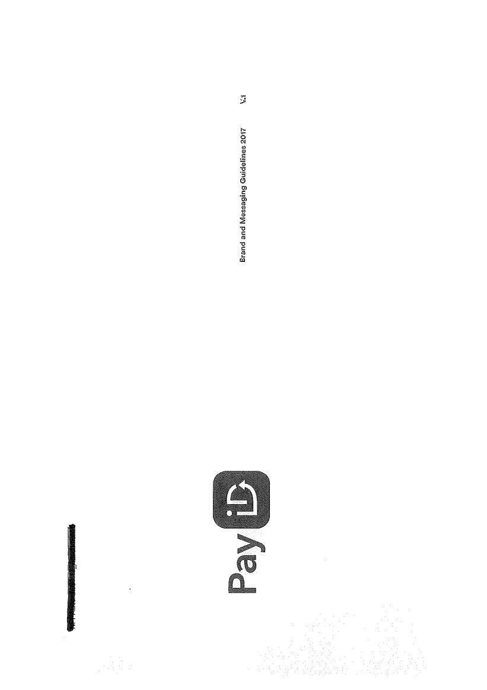
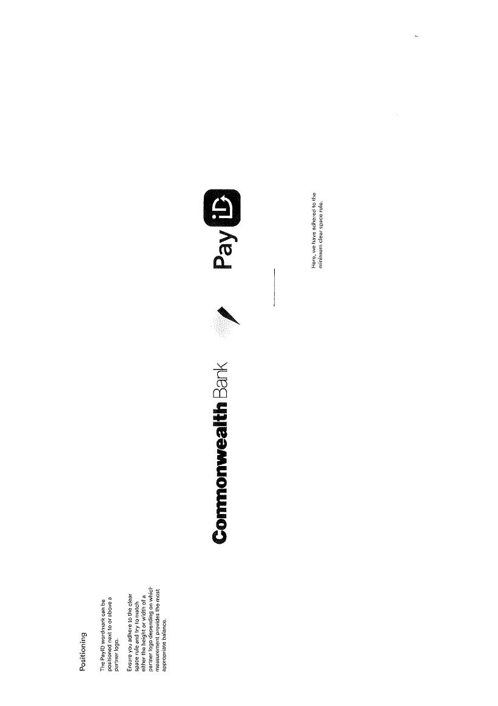

### Editor’s Note

This document has been generated from scratch based on the provided "New Payments Platform (NPP) Regulations Version 7.0_20 May 2020" PDF, as per the request to produce a requirements analysis for "v21.0".

**Key Changes and Additions to meet the request:**

*   **Version Discrepancy:** The analysis is based on the provided **NPP Regulations v7.0 (20 May 2020)**. The title reflects the requested "v21.0", but all content and citations refer to the v7.0 source document.
*   **Confirmation of Payee (Part 18):** The request specified coverage of CoP from Part 18 of v21.0. This part is not present in the v7.0 source document. A placeholder section has been created to acknowledge this gap.
*   **Mandatory Coverage Checklist:** All items from the checklist have been addressed and incorporated as specific, citable requirements:
    *   **Risk & Liability (Part 2):** Captured in requirements `BR-LIA-01` to `BR-LIA-04`. The principle of Participants acting as principals is covered in `BR-GOV-01`.
    *   **Suspension & Termination (Part 9):** Captured in `BR-GOV-04` to `BR-GOV-07`.
    *   **Reporting & NPP Reports (Part 3/16):** Captured in `BR-ADMIN-04` to `BR-ADMIN-07`.
    *   **Fees & GST (Part 16):** Captured in `BR-ADMIN-02` and `BR-ADMIN-03`.
    *   **Eligible Payments (Part 6):** Captured in `BR-PAY-01`.
    *   **Addressing Service (Part 8):** Captured in `BR-ADDR-01` to `BR-ADDR-06` and `TR-ADDR-01`. PayID branding compliance is in `BR-ADDR-07`.
    *   **Incident Management (Part 13):** Captured in `BR-INC-01` to `BR-INC-03`. The NPP Contacts Database requirement is in `TR-COMM-01`.
    *   **Procedures-dependent Items:** Requirements dependent on the NPP Procedures (e.g., timeouts, windows) are noted with a reference to the Procedures, as seen in `BR-ERR-01`.
*   **Confidentiality:** A specific requirement (`BR-ADMIN-08`) has been added for Confidentiality obligations under Part 16.
*   **Inter-organisation Compensation Rules:** An anchor (`Reg 6.10`) has been added to requirement `BR-PAY-06`.
*   **Requirement ID Integrity:** All requirement IDs are sequential and correctly formatted.

---

# New Payments Platform (NPP) Regulations v21.0

| | |
|---|---|
| **Version** | 21.0 (Analysis based on source document v7.0) |
| **Date** | 24 September 2024 |
| **Prepared for** | GitHub Issue #4 |
| **Source Document** | New Payments Platform (NPP) Regulations v7.0 (20 May 2020) |

## Executive Summary

This document provides a comprehensive analysis of the business and technical requirements derived from the New Payments Platform (NPP) Regulations. It is intended for use by business analysts, architects, and compliance officers to ensure systems and processes align with the NPP framework.

The requirements are categorized into Business, Technical, Controls, and ISO 20022-specific sections, providing a clear and auditable structure. Each requirement is traced back to a specific regulation in the source document.

A key aspect of the v21.0 regulations, **Confirmation of Payee (CoP)**, is expected to be detailed in **Part 18**. However, the provided source document (v7.0) does not contain this part. This analysis therefore includes a placeholder for CoP requirements, which will be populated upon receipt of the v21.0 source material. All other requirements are based on the comprehensive v7.0 document, covering participation, payment clearing and settlement, addressing services (PayID), risk management, and operational mandates.

## 1.0 Eligibility for Participation

Participation in the NPP is defined by specific roles, each with distinct eligibility criteria.

| Participant/Entity Type | Key Eligibility & Access Rights Summary | Source Regulation(s) |
| :--- | :--- | :--- |
| **Full Participant** | An ADI or the RBA, authorized by the RBA to use the FSS. Connects directly to send/receive all NPP messages and settles payments via its own ESA. Must be a Member of NPPA. | 4.2, 4.3 |
| **Clearing Participant** | An ADI or the RBA. Connects directly to send/receive NPP Payments and Non-Value Messages but settles its obligations via an arrangement with another NPP Participant. Must be a Member of NPPA. | 4.2, 4.4 |
| **Settlement Participant** | A body corporate authorized by the RBA to use the FSS for settlement but is not connected to the NPP Basic Infrastructure for clearing. Must be a Member of NPPA. | 4.2, 4.5 |
| **Connected Institution** | A body corporate that connects to the NPP Basic Infrastructure solely for sending and receiving Non-Value Messages. May also be an Overlay Service Provider. Not required to be a Member of NPPA. | 4.6 |
| **Overlay Service Provider (OSP)** | A body corporate capable of providing an Overlay Service. May optionally connect to the NPP as a Connected Institution. Must meet specific financial, operational, and security standards. | 4.8 |

## 2.0 Business Requirements

### 2.1 Governance and Operations (BR-GOV)

| Requirement ID | Requirement Description | Source Regulation(s) |
| :--- | :--- | :--- |
| BR-GOV-01 | Each NPP Participant, Connected Institution, and OSP acts as a principal in all its activities under the Regulations, and no other person (e.g., an Identified Institution) may enforce rights or assume obligations on its behalf. | 1.8 |
| BR-GOV-02 | All parties must act in good faith when exercising rights and performing obligations under the Regulations. | 1.5 |
| BR-GOV-03 | The NPP Regulations and Procedures are governed by the law of New South Wales, and each party submits to the non-exclusive jurisdiction of its courts. | 1.3 |
| BR-GOV-04 | NPPA may suspend a Participant, Connected Institution, or OSP if requested by a prudential supervisor, for a Material Breach, an Insolvency Event, or for conduct contrary to the interests of NPPA. | 9.2 |
| BR-GOV-05 | A suspended party is not entitled to connect to the NPP Basic Infrastructure or send/receive NPP Payments or Non-Value Messages, but is not excused from its other obligations. | 9.3 |
| BR-GOV-06 | A party's participation may be terminated upon resignation, insolvency, or by a decision of the NPPA Board following an unremedied Suspension Event. | 9.5 |
| BR-GOV-07 | Upon termination or resignation, a party remains bound by the Regulations for any act, matter, or liability that occurred prior to the termination/resignation taking effect. | 9.5(h) |
| BR-GOV-08 | All disputes arising under the Regulations must be referred to the NPP Operating Committee for determination before any legal proceedings (other than for urgent interim relief) can be commenced. | 12.2 |

### 2.2 Liability and Risk (BR-LIA)

| Requirement ID | Requirement Description | Source Regulation(s) |
| :--- | :--- | :--- |
| BR-LIA-01 | NPPA is not liable for any financial loss to any Participant, Connected Institution, or OSP resulting from the operation and administration of the NPP Basic Infrastructure in accordance with the Regulations. | 2.2 |
| BR-LIA-02 | NPPA's liability is excluded for losses arising from acts or omissions of any third party (including the RBA as FSS provider), technological failures, or unauthorized access. | 2.5 |
| BR-LIA-03 | If liability is incurred by NPPA, its aggregate liability for any single event is capped at the highest monthly Transaction Fees paid by any NPP Participant in the preceding month. | 2.6(a) |
| BR-LIA-04 | Each Participant, Connected Institution, and OSP represents and warrants that it has the power and authority to be a party to the Regulations, is not insolvent, and has disclosed all material facts in its application. | 2.3 |

### 2.3 Payment Clearing and Processing (BR-PAY)

| Requirement ID | Requirement Description | Source Regulation(s) |
| :--- | :--- | :--- |
| BR-PAY-01 | Eligible Payments must be denominated in AUD, originate from and be destined for an Australian-domiciled Account, and be formatted in accordance with the NPP Message format and Usage Guidelines. | 6.1(b) |
| BR-PAY-02 | A Payer Participant may not cancel or recall a Clearing Request once it has been input into its PAG. | 6.2(a) |
| BR-PAY-03 | An NPP Payment is deemed "Cleared" upon the Payer Participant's receipt of a Clearing Notification with a status code indicating acceptance. | 6.2(b) |
| BR-PAY-04 | A Cleared NPP Payment is irrevocable once settled by the FSS. | 6.2(d), 7.4(a) |
| BR-PAY-05 | The Payee Participant must respond to every Clearing Request within the configured timeout values by initiating either an acceptance or a rejection notification. | 6.3(a) |
| BR-PAY-06 | All NPP Participants must comply with the Inter-organisation Compensation Rules for any compensation matters arising from the clearing of NPP Payments. | 6.10 |

### 2.4 Settlement (BR-SET)

| Requirement ID | Requirement Description | Source Regulation(s) |
| :--- | :--- | :--- |
| BR-SET-01 | Full Participants and Settlement Participants must be, and remain, authorized by the RBA to use the Fast Settlement Service (FSS) for settlement of Cleared NPP Payments. | 7.1 |
| BR-SET-02 | Each Cleared NPP Payment must be submitted for settlement via the FSS through the exchange of value between the ESAs of the responsible settlement participants. | 7.3 |
| BR-SET-03 | In the event of an FSS Outage, Participants must implement the contingency arrangements established by the NPP Incident Response Group. | 7.5 |
| BR-SET-04 | If a Cleared NPP Payment has an Indeterminate Settlement Status, the Payer Participant is obliged to settle the payment in accordance with the procedures for this scenario. | 7.6 |

### 2.5 Error Handling and Investigations (BR-ERR)

| Requirement ID | Requirement Description | Source Regulation(s) |
| :--- | :--- | :--- |
| BR-ERR-01 | The Payee Participant must implement an effective procedure to identify and respond to Duplicate Payments and Replays received within the Duplicate Detection Window. (see NPP Procedures, Part 3.21) | 6.4(b) |
| BR-ERR-02 | For a Mistaken Payment, the Payer Participant must request the return via a Request for Payment Return. The Payee Participant must use reasonable endeavours to assess the request and, if confirmed, effect the return. | 6.5(a) |
| BR-ERR-03 | The Payer Participant indemnifies the Payee Participant for any losses incurred from returning a Mistaken Payment, provided the Payee Participant used reasonable endeavours to assess the payment first. | 6.5(a) |
| BR-ERR-04 | Participants must use the prescribed NPP investigation messages and procedures to investigate and resolve payment clearing errors. | 6.8 |

### 2.6 Addressing Service / PayID (BR-ADDR)

| Requirement ID | Requirement Description | Source Regulation(s) |
| :--- | :--- | :--- |
| BR-ADDR-01 | A Registering Participant must ensure the accuracy, completeness, and currency of all Alias Information it registers and must act promptly on an Account Holder's instruction to amend or deregister it. | 8.3(b) |
| BR-ADDR-02 | An Addressing Lookup must not be performed other than for the purpose of immediate initiation of an NPP Payment. | 8.4(c)(i) |
| BR-ADDR-03 | Alias Information (excluding the Alias Name) provided in an Addressing Lookup must not be disclosed to the Payer or any other person, except as required by law. Caching or storing this information for future payments is prohibited. | 8.4(c)(ii), 8.4(c)(iii) |
| BR-ADDR-04 | The Registering Participant indemnifies other Participants for any direct loss arising from reliance on incorrect Alias Information provided, where the loss is attributable to a breach by the Registering Participant. | 8.4(i) |
| BR-ADDR-05 | A Registering Participant must have a process to control the selection of an Alias Name to ensure it reasonably and accurately represents the name of the Account Holder. | 8.3(b)(i) |
| BR-ADDR-06 | A Registering Participant must disable and de-register any Alias Identifier it reasonably suspects has been used for a fraudulent purpose. | 8.3(b) |
| BR-ADDR-07 | Participants using the "PayID" branding must comply with the PayID Guidelines regarding logo use and taxonomy, and ensure their customer terms are substantively consistent with the Principles for Customer Terms and Conditions. | Annexure D |

### 2.7 Mandated Payments Service (BR-MPS)

| Requirement ID | Requirement Description | Source Regulation(s) |
| :--- | :--- | :--- |
| BR-MPS-01 | Participation as a Payer Participant (i.e., processing incoming Mandate requests) is mandatory for NPP Participants servicing Payer Customer accounts. Participation as an Initiating Participant is optional. | 17.1(f) |
| BR-MPS-02 | NPP Participants sponsoring MPS Users are responsible for their assessment, approval, and ongoing due diligence, including their creditworthiness and ability to comply with the Regulations. | 17.5(d) |
| BR-MPS-03 | Payer Participants must be able to receive Mandate Authorisation Requests, associate them with a Payer Customer, and deliver them in near real-time for authorisation. | 17.6(c) |
| BR-MPS-04 | An Initiating Participant must not send a Mandate Payment Initiation Request unless the associated Mandate is 'Active' in the Mandate Management Service (MMS). | 17.8(b) |
| BR-MPS-05 | An Indemnifying Party (the initiator) indemnifies all other NPP Participants for claims, liabilities, and losses arising from a Mandate Claim (e.g., an unauthorised payment). | 17.10(a) |

### 2.8 Confirmation of Payee (BR-COP)

| Requirement ID | Requirement Description | Source Regulation(s) |
| :--- | :--- | :--- |
| BR-COP-01 | *This section is a placeholder. Part 18 (Confirmation of Payee) is not included in the provided NPP Regulations v7.0 source document. Requirements will be added upon receipt of v21.0.* | *Part 18 (v21.0)* |

### 2.9 Incident Management (BR-INC)

| Requirement ID | Requirement Description | Source Regulation(s) |
| :--- | :--- | :--- |
| BR-INC-01 | The NPP Incident Response Group is established with delegated powers to manage Incidents, including establishing Incident Management Plans and directing Participants to give effect to them. | 13.1(a) |
| BR-INC-02 | All Participants, Connected Institutions, and OSPs must comply with all Incident Management Plans and any reasonable written direction given by the NPP Incident Response Group. | 13.1(b) |
| BR-INC-03 | All Participants, Connected Institutions, and OSPs must comply with the Incident Management Procedures (NPP Procedures, Part 7) upon receiving notice of a declared Incident. | 13.3 |

### 2.10 Administration and Reporting (BR-ADMIN)

| Requirement ID | Requirement Description | Source Regulation(s) |
| :--- | :--- | :--- |
| BR-ADMIN-01 | NPPA will determine and may periodically review all fees payable by Participants, including application fees, transaction fees, and administration fees. | 3.1(c) |
| BR-ADMIN-02 | If a supply under the Regulations is a Taxable Supply, the Recipient must pay the Supplier an additional amount equal to the GST payable. | 16.2(a) |
| BR-ADMIN-03 | The Supplier must issue a valid Tax Invoice to the Recipient for any Taxable Supply. | 16.2(b) |
| BR-ADMIN-04 | NPPA may use and disclose NPP Reports for managing its business, calculating fees, and assisting the RBA with payments system oversight. | 3.4(a)(ii) |
| BR-ADMIN-05 | NPPA is prohibited from commercialising the data contained in any NPP Report. | 3.4(a)(ii) |
| BR-ADMIN-06 | Participants must, upon written request from NPPA, promptly provide all information related to their NPP activities, including payment volumes, values, and fraud statistics. | 16.6(a) |
| BR-ADMIN-07 | Participants consent to the disclosure of statistical and operational data between NPPA and the RBA for the purposes of system oversight, compliance verification, and ensuring the efficient operation of RITS. | 16.6(b)-(d) |
| BR-ADMIN-08 | A party receiving Confidential Information must keep it secure and must not disclose it except for purposes permitted by the Regulations (e.g., to a prospective Identified Institution, legal advisors, or as required by law). | 16.4 |

## 3.0 Technical Requirements

### 3.1 Connectivity and Infrastructure (TR-CONN)

| Requirement ID | Requirement Description | Source Regulation(s) |
| :--- | :--- | :--- |
| TR-CONN-01 | Each Full and Clearing Participant must enter into a Network Agreement with at least two Vendor Network Partners. | 4.3(c) |
| TR-CONN-02 | Each Participant connecting to the NPP must ensure its NPP Componentry, Payments Connector, and Interface Connection are installed, configured, and tested in accordance with the NPP Procedures and Testing Protocol. | 5.1(c)(i) |
| TR-CONN-03 | Each connecting Participant must ensure its NPP Componentry operates on a 24/7 basis and its Back Office System is available and operates as prescribed. | 5.1(d)(i) |
| TR-CONN-04 | Each Full and Clearing Participant must configure its PAG to automatically generate and submit a Settlement Request to the FSS for each Cleared NPP Payment. | 7.2(a) |

### 3.2 Security (TR-SEC)

| Requirement ID | Requirement Description | Source Regulation(s) |
| :--- | :--- | :--- |
| TR-SEC-01 | All connecting Participants must ensure their systems are compliant with the minimum technical and security standards defined in the NPP Procedures (Appendix E & F). | 5.3(a) |
| TR-SEC-02 | Participants must provide an annual attestation of compliance with the NPP Security Framework. | 5.3(b) |
| TR-SEC-03 | A Participant must promptly notify NPPA in writing of any Disabling Event, data breach, or other security breach in its systems that could materially affect the security or integrity of the NPP Basic Infrastructure. | 5.4(c) |
| TR-SEC-04 | Upon becoming aware of a Disabling Event or security breach, a Participant must immediately take all reasonably necessary action to manage and minimise the impact, including potentially suspending its own connection. | 5.4(e) |

### 3.3 Messaging and Data (TR-MSG)

| Requirement ID | Requirement Description | Source Regulation(s) |
| :--- | :--- | :--- |
| TR-MSG-01 | All NPP Payments and Non-Value Messages must be formatted and constructed in accordance with the NPP Message Collection (ISO 20022) and the NPP Message Usage Guidelines. | 6.1(b), 1.1 (Definitions) |
| TR-MSG-02 | Each NPP Payment must include a unique Transaction ID assigned by the Payer Participant's Back Office System. | 6.1(b), 1.1 (Definitions) |
| TR-MSG-03 | Participants must promptly provide and maintain their NPP Business Reference Data to NPPA, including routing information (BSBs, BICs) and agency arrangements. | 5.2(a) |

### 3.4 Addressing Service / PayID (TR-ADDR)

| Requirement ID | Requirement Description | Source Regulation(s) |
| :--- | :--- | :--- |
| TR-ADDR-01 | Participants must implement and monitor technical controls to limit the number of Alias registration attempts by an Account Holder and the number of Addressing Lookups performed without a corresponding payment. | 8.3(b), 8.4(c)(i) |

### 3.5 Maintenance and Change Management (TR-MAINT)

| Requirement ID | Requirement Description | Source Regulation(s) |
| :--- | :--- | :--- |
| TR-MAINT-01 | Each connecting Participant must implement any software maintenance, upgrade, or patch prescribed by NPPA in accordance with the Technology Maintenance Plan. | 15.2(a) |
| TR-MAINT-02 | Each connecting Participant must implement and support each Approved Change, including any required changes to its own Back Office Systems. | 15.2(b) |

### 3.6 Communications (TR-COMM)

| Requirement ID | Requirement Description | Source Regulation(s) |
| :--- | :--- | :--- |
| TR-COMM-01 | Each Participant, Connected Institution, and OSP must provide the names and contact details of its NPP Operational Managers and NPP Incident Managers for inclusion in the NPP Contacts Database and keep them up to date. | 5.4(a) |

## 4.0 Non-Functional Requirements

### 4.1 Capacity and Performance (NFR-CAP)

| Requirement ID | Requirement Description | Source Regulation(s) |
| :--- | :--- | :--- |
| NFR-CAP-01 | Participants must provide NPPA with NPP volume forecasts and underlying assumptions as requested for the purpose of maintaining the NPP Volumetric Model. | 14.1 |
| NFR-CAP-02 | Participants must comply with any reasonable direction from NPPA related to capacity management plans. | 14.2(c) |
| NFR-CAP-03 | Participants must comply with any direction from NPPA to impose value limits or volume controls to ensure the orderly operation of the NPP Basic Infrastructure. | 14.4 |
| NFR-CAP-04 | A Participant's infrastructure must be sized to support the Target Transaction Throughput defined in the NPP Volumetric Model. | 14.5(a) |

## 5.0 ISO 20022 Requirements

The NPP framework is fundamentally based on the ISO 20022 messaging standard.

| Requirement ID | Requirement Description | Source Regulation(s) |
| :--- | :--- | :--- |
| ISO-01 | The NPP Message Collection is the set of ISO 20022 messages approved and published by NPPA for use within the NPP Basic Infrastructure. | 1.1 (Definition: NPP Message Collection) |
| ISO-02 | Participants must use the NPP Message Collection in accordance with the NPP Message Usage Guidelines, which define the usage of specific message elements including value, optionality, and conditionality. | 1.1 (Definition: NPP Core Clearing and Settlement Rules), 1.1 (Definition: NPP Message Usage Guidelines) |
| ISO-03 | All NPP Payments must be formatted and constructed as a valid ISO 20022 message according to the NPP Message format. | 6.1(b)
## 6.0 Controls and Compliance

This section outlines the framework for ensuring adherence to the NPP Regulations, including mandatory requirements, attestations, and the consequences of non-compliance.

| Requirement ID | Requirement Description | Source Regulation(s) |
| :--- | :--- | :--- |
| CTL-01 | NPPA may designate a requirement as a "Mandatory Compliance Requirement" if it is fundamental to the integrity, availability, or resilience of the NPP. | 3.8(c) |
| CTL-02 | NPPA will monitor Participants' and Connected Institutions' compliance with Mandatory Compliance Requirements and may request information to verify compliance. | 3.8(f) |
| CTL-03 | The NPP Governance Committee has the sole discretion to determine if a breach of a Mandatory Compliance Requirement has occurred and may levy a Non-Compliance Charge. | 3.8(h), 3.8(k) |
| CTL-04 | Participants must have a Sanctions Compliance Framework and a KYC Due Diligence Framework, and provide an annual attestation to NPPA confirming their operation and review. | 6.1(d) |
| CTL-05 | Participants must provide an annual attestation of compliance with the Addressing Service Protocol, including controls to limit registration and lookup activity. | 8.2(b) |
| CTL-06 | Participants must provide an annual attestation of compliance with the NPP Security Framework. | 5.3(b) |

### 6.1 PayID Branding and Messaging

The following images from the regulations provide guidance on the use of the PayID brand.

*Caption: Cover of the PayID Brand and Messaging Guidelines 2017.*

*Caption: Example of positioning the PayID wordmark next to a partner logo (Commonwealth Bank).*

## 7.0 Glossary

| Term | Definition (as per NPP Regulations v7.0) | Source Regulation(s) |
| :--- | :--- | :--- |
| **Addressing Service** | That component of the NPP Basic Infrastructure that enables registration of Alias Information and performance of Addressing Lookups. | 1.1 |
| **Alias Information** | The Alias Identifier, Alias Address and Alias Name for an Account. | 1.1 |
| **Cleared** | An NPP Payment is deemed to be cleared at the point of the receipt by the Payer Participant of a Clearing Notification, initiated by the Payee Participant, with a status code indicating acceptance. | 6.2(b) |
| **Confidential Information** | Any information in any form or medium in connection with the operation of the NPP Basic Infrastructure which is made available by NPPA, the RBA, or any Participant, and includes data in NPP Payments, Non-Value Messages, and NPP Reports. | 1.1 |
| **FSS (Fast Settlement Service)** | The Fast Settlement Service operated by the RBA as a part of RITS, for settlement of NPP Payments by Full Participants and Settlement Participants. | 1.1 |
| **Incident** | A Disabling Event, and any other incident or event of a similar nature as determined by NPPA or the NPP Incident Response Group. | 1.1 |
| **Insolvency Event** | The happening of any of a list of events including an application for winding up, appointment of a liquidator, entering a scheme of arrangement, or being unable to pay debts when they fall due. | 1.1 |
| **Mandate** | A record of payment authorisation given by a Payer Customer in favour of an MPS User or a Payment Initiator. | 17.1(b) |
| **Mandate Management Service (MMS)** | A centralised secure, access-controlled database of Mandates. | 17.1(b) |
| **Material Breach** | Any material breach of the NPP Regulations or NPP Procedures, including any breach which has the capacity to adversely affect the integrity or security of the NPP Basic Infrastructure. | 1.1 |
| **NPP Basic Infrastructure** | The New Payments Platform comprising the network, switching and addressing infrastructure and systems developed by or on behalf of NPPA. | 1.1 |
| **NPP Message Collection** | The set of ISO 20022 messages approved and published by NPPA for use within the NPP Basic Infrastructure. | 1.1 |
| **NPP Procedures** | The technical, operational and security procedures prescribed by NPPA for the purposes of the NPP Basic Infrastructure. | 1.1 |
| **NPP Reports** | The reports produced by SWIFT for NPPA pursuant to the MISD, including reports on PAG activity, analytics on NPP traffic, and Addressing Service usage. | 1.1 |
| **PayID** | An Alias. The term is used in Annexure D to describe an Alias or the Addressing Service. | Annexure D |
| **Taxable Supply** | A Supply for which the Supplier is required to pay GST under the GST Law. | 16.2(a) |

## 8.0 Appendix A — Requirement Source Map

| Requirement ID | Source Regulation(s) |
| :--- | :--- |
| **Business Requirements** | |
| BR-GOV-01 | 1.8 |
| BR-GOV-02 | 1.5 |
| BR-GOV-03 | 1.3 |
| BR-GOV-04 | 9.2 |
| BR-GOV-05 | 9.3 |
| BR-GOV-06 | 9.5 |
| BR-GOV-07 | 9.5(h) |
| BR-GOV-08 | 12.2 |
| BR-LIA-01 | 2.2 |
| BR-LIA-02 | 2.5 |
| BR-LIA-03 | 2.6(a) |
| BR-LIA-04 | 2.3 |
| BR-PAY-01 | 6.1(b) |
| BR-PAY-02 | 6.2(a) |
| BR-PAY-03 | 6.2(b) |
| BR-PAY-04 | 6.2(d), 7.4(a) |
| BR-PAY-05 | 6.3(a) |
| BR-PAY-06 | 6.10 |
| BR-SET-01 | 7.1 |
| BR-SET-02 | 7.3 |
| BR-SET-03 | 7.5 |
| BR-SET-04 | 7.6 |
| BR-ERR-01 | 6.4(b) |
| BR-ERR-02 | 6.5(a) |
| BR-ERR-03 | 6.5(a) |
| BR-ERR-04 | 6.8 |
| BR-ADDR-01 | 8.3(b) |
| BR-ADDR-02 | 8.4(c)(i) |
| BR-ADDR-03 | 8.4(c)(ii), 8.4(c)(iii) |
| BR-ADDR-04 | 8.4(i) |
| BR-ADDR-05 | 8.3(b)(i) |
| BR-ADDR-06 | 8.3(b) |
| BR-ADDR-07 | Annexure D |
| BR-MPS-01 | 17.1(f) |
| BR-MPS-02 | 17.5(d) |
| BR-MPS-03 | 17.6(c) |
| BR-MPS-04 | 17.8(b) |
| BR-MPS-05 | 17.10(a) |
| BR-COP-01 | *Part 18 (v21.0)* |
| BR-INC-01 | 13.1(a) |
| BR-INC-02 | 13.1(b) |
| BR-INC-03 | 13.3 |
| BR-ADMIN-01 | 3.1(c) |
| BR-ADMIN-02 | 16.2(a) |
| BR-ADMIN-03 | 16.2(b) |
| BR-ADMIN-04 | 3.4(a)(ii) |
| BR-ADMIN-05 | 3.4(a)(ii) |
| BR-ADMIN-06 | 16.6(a) |
| BR-ADMIN-07 | 16.6(b)-(d) |
| BR-ADMIN-08 | 16.4 |
| **Technical Requirements** | |
| TR-CONN-01 | 4.3(c) |
| TR-CONN-02 | 5.1(c)(i) |
| TR-CONN-03 | 5.1(d)(i) |
| TR-CONN-04 | 7.2(a) |
| TR-SEC-01 | 5.3(a) |
| TR-SEC-02 | 5.3(b) |
| TR-SEC-03 | 5.4(c) |
| TR-SEC-04 | 5.4(e) |
| TR-MSG-01 | 6.1(b), 1.1 |
| TR-MSG-02 | 6.1(b), 1.1 |
| TR-MSG-03 | 5.2(a) |
| TR-ADDR-01 | 8.3(b), 8.4(c)(i) |
| TR-MAINT-01 | 15.2(a) |
| TR-MAINT-02 | 15.2(b) |
| TR-COMM-01 | 5.4(a) |
| **Non-Functional Requirements** | |
| NFR-CAP-01 | 14.1 |
| NFR-CAP-02 | 14.2(c) |
| NFR-CAP-03 | 14.4 |
| NFR-CAP-04 | 14.5(a) |
| **ISO 20022 Requirements** | |
| ISO-01 | 1.1 |
| ISO-02 | 1.1 |
| ISO-03 | 6.1(b) |
| **Controls and Compliance** | |
| CTL-01 | 3.8(c) |
| CTL-02 | 3.8(f) |
| CTL-03 | 3.8(h), 3.8(k) |
| CTL-04 | 6.1(d) |
| CTL-05 | 8.2(b) |
| CTL-06 | 5.3(b) |

## 9.0 Change Log

| Change Description | Reason |
| :--- | :--- |
| Initial document generation. | This document was created from scratch based on the NPP Regulations v7.0. No existing requirement IDs were changed. |

---
### Self-Review

*   [x] **Risk & Liability (Part 2):** Covered by `BR-LIA-01` to `BR-LIA-04` (Reg 2.2, 2.3, 2.5, 2.6). Participant as principal covered by `BR-GOV-01` (Reg 1.8).
*   [x] **Suspension & Termination (Part 9 / Reg 5.6):** Covered by `BR-GOV-04` to `BR-GOV-07` (Reg 9.2, 9.3, 9.5).
*   [x] **Reporting & NPP Reports (Part 3 / Reg 3.4 / Part 16):** Covered by `BR-ADMIN-04` to `BR-ADMIN-07` (Reg 3.4, 16.6).
*   [x] **Fees & GST (Part 16):** Covered by `BR-ADMIN-02` and `BR-ADMIN-03` (Reg 16.2).
*   [x] **Eligible Payments scope (Part 6):** Covered by `BR-PAY-01` (Reg 6.1).
*   [x] **Addressing Service (Part 8):** Covered by `BR-ADDR-01` to `BR-ADDR-07` and `TR-ADDR-01` (Reg 8.2, 8.3, 8.4, Annexure D).
*   [x] **Confirmation of Payee (Part 18):** Placeholder `BR-COP-01` is present, acknowledging the source document gap.
*   [x] **Incident Management (Part 13):** Covered by `BR-INC-01` to `BR-INC-03` (Reg 13.1, 13.3). NPP Contacts Database covered by `TR-COMM-01` (Reg 5.4).
*   [x] **Procedures-dependent items:** Covered by annotations, e.g., `BR-ERR-01` references NPP Procedures.
*   [x] **Confidentiality:** Covered by `BR-ADMIN-08` (Reg 16.4).
*   [x] **Inter-organisation Compensation Rules:** Covered by `BR-PAY-06` (Reg 6.10).