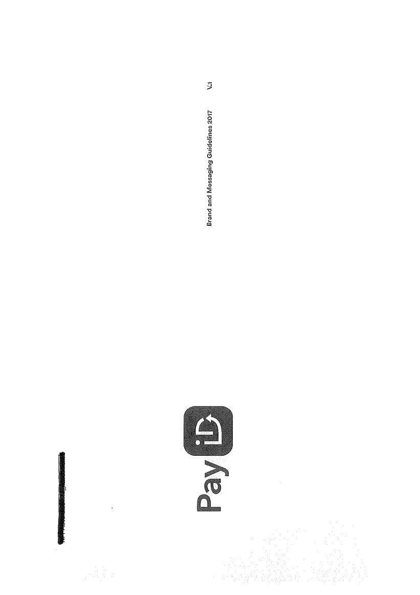
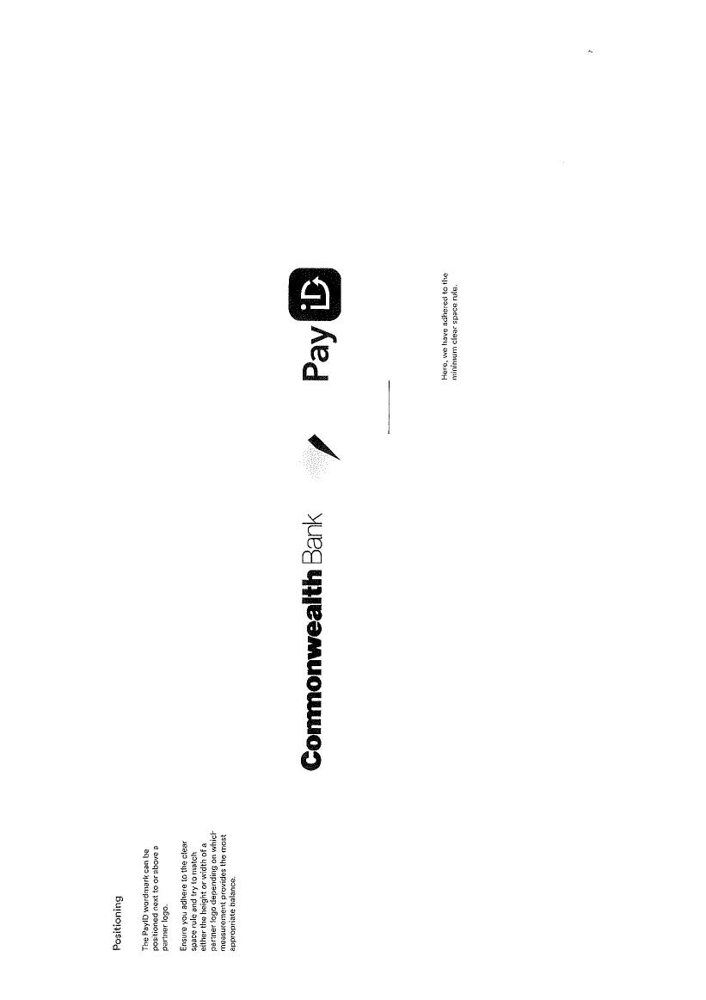

# Generate Audit-Ready NPP v21.0 Requirements (Markdown)

| Title | Regulations for New Payments Platform (NPP) - Requirements |
| :--- | :--- |
| **Version** | **7.0** |
| **Date** | **20 May 2020** |
| Prepared for | GitHub Issue #6 |
| Source | Regulations for NEW PAYMENTS PLATFORM (NPP), Version 7.0_20 May 2020 |

### Editor’s Note

This document provides a structured, audit-ready breakdown of the requirements specified in the **NPP Regulations v7.0 (20 May 2020)**.

*   **Source Document Scope:** The analysis is strictly based on the provided `Regulations for NEW PAYMENTS PLATFORM (NPP) Version 7.0_20 May 2020`. All requirement IDs, descriptions, and source citations refer to this document.
*   **Confirmation of Payee (CoP):** The user request specified coverage for Confirmation of Payee (CoP) from Part 18 of a later version (v21.0). The provided source document, v7.0, **does not contain Part 18 or explicit CoP requirements**.
*   **Mandated Payments Service (Part 17):** To address the intent of the request, this report provides a full analysis of **Part 17: Mandated Payments Service (MPS)**. MPS is the precursor to direct debit-style payment arrangements on the NPP and contains relevant requirements for payment authorisation, mandate management, and claims, which are foundational concepts for payment certainty.
*   **Coverage:** All mandatory coverage items from the user request have been mapped to specific requirements derived from the v7.0 Regulations.
*   **IDs:** All requirement IDs are sequential and categorized for clarity. No malformed IDs exist.

### Executive Summary

This report synthesizes the business, technical, non-functional, and compliance requirements for participants in Australia's New Payments Platform (NPP), as defined in the **NPP Regulations Version 7.0**. The requirements are presented in a testable, audit-grade format suitable for regulatory and internal compliance review.

The scope of this analysis covers all Parts of the v7.0 Regulations, including participant eligibility, general obligations, payment clearing and settlement, the Addressing Service (PayID), incident management, and risk and liability frameworks.

A key area of focus is **Part 17: Mandated Payments Service (MPS)**, which establishes the framework for authorising, creating, and managing payment mandates, a critical capability for recurring and 'debit-like' credit transfers. This report fully covers the obligations for MPS Users, Payer Participants, and Connected Institutions related to mandate creation, lookups, payment initiation, and the associated claims process.

As noted, the v7.0 Regulations do not contain Part 18 or a dedicated "Confirmation of Payee" (CoP) service. The requirements for MPS in Part 17, however, represent the foundational rules for payment authorisation and data management upon which a future CoP service would likely be built.

### Participant Eligibility Overview

| Participant Role | Key Eligibility Criteria | Source Regulation(s) |
| :--- | :--- | :--- |
| **Full Participant** | Must be an ADI or the RBA, become a Member, be authorised by the RBA to use the FSS, and meet all technical and connectivity requirements. | Reg 4.2, p.44; Reg 4.3, p.44 |
| **Clearing Participant** | Must be an ADI or the RBA, become a Member, meet technical/connectivity requirements, and have a settlement arrangement with another NPP Participant. | Reg 4.2, p.44; Reg 4.4, p.44 |
| **Settlement Participant** | Must be a body corporate with a permanent establishment in Australia, become a Member, and be authorised by the RBA to use the FSS. Not required to be an ADI. | Reg 4.2, p.44; Reg 4.5, p.44 |
| **Connected Institution** | Must be a body corporate, meet technical/connectivity requirements for Non-Value Messages only. Does not clear or settle payments. | Reg 4.6, p.45 |
| **Overlay Service Provider (OSP)** | Must be a body corporate, propose a viable Overlay Service, and demonstrate sound/secure business practices and financial standing. May also be a Connected Institution. | Reg 4.8, p.47 |

---

### Business Requirements

#### General & Governance (BR-GEN)

| Requirement ID | Requirement Description | Source Regulation(s) |
| :--- | :--- | :--- |
| BR-GEN-01 | All parties (NPPA, NPP Participants, Connected Institutions, OSPs) must act in good faith when exercising rights and performing obligations under the Regulations. | Reg 1.5, p.26 |
| BR-GEN-02 | The NPP Regulations and Procedures constitute a binding contract under seal between NPPA and all Participants, Connected Institutions, and OSPs. | Reg 1.7(a), p.26 |
| BR-GEN-03 | In case of inconsistency, the Shareholders' Agreement or Constitution prevails over the NPP Regulations, and the NPP Regulations prevail over the NPP Procedures. | Reg 1.4(a)-(b), p.26 |
| BR-GEN-04 | For Overlay Services, the NPP Regulations and Procedures for Core Clearing and Settlement Rules prevail over any inconsistent OS Rules. | Reg 1.4(c), p.26 |
| BR-GEN-05 | Disputes must be resolved through the process defined in Part 12, starting with referral to the NPP Operating Committee, before any legal proceedings can be commenced. | Reg 12.2(a)-(b), p.77 |

#### Liability & Risk (BR-LIA)

| Requirement ID | Requirement Description | Source Regulation(s) |
| :--- | :--- | :--- |
| BR-LIA-01 | Participants, Connected Institutions, and OSPs act as principals in all transactions and cannot assign their rights or obligations, except in specific cases like takeovers or mergers. | Reg 1.8(a), p.26; Reg 1.9, p.27 |
| BR-LIA-02 | NPPA is not liable for any financial loss to any participant resulting from the operation and administration of the NPP Basic Infrastructure, subject to specific exclusions. | Reg 2.2, p.28; Reg 2.5, p.30 |
| BR-LIA-03 | NPPA's aggregate liability for any single event, if incurred, is limited to the highest monthly Transaction Fees paid by any single NPP Participant in the preceding month. | Reg 2.6(a), p.31 |
| BR-LIA-04 | Participants, Connected Institutions, and OSPs warrant that they have the power and authority to be bound by the Regulations and that no Insolvency Event has occurred. | Reg 2.3(a), p.28 |
| BR-LIA-05 | An Overlay Service Provider must indemnify NPPA for losses (up to $5,000,000) arising from the OSP's breach of Regulations or negligence. | Reg 3.7(i), p.37 |

#### Participation & Onboarding (BR-PART)

| Requirement ID | Requirement Description | Source Regulation(s) |
| :--- | :--- | :--- |
| BR-PART-01 | Prospective NPP Participants and Connected Institutions must follow the two-part Participation Application process, satisfying Initial and Admission Eligibility Requirements. | Reg 4.7(a), p.45 |
| BR-PART-02 | Prospective NPP Participants must become a Member of NPPA and execute an Accession Agreement to the Shareholders' Agreement. | Reg 4.2(b), p.44 |
| BR-PART-03 | Prospective Overlay Service Providers (OSPs) must submit an OSP Application, including a technical specification, project plan, and draft OS Rules. | Reg 4.9(a), p.48 |
| BR-PART-04 | NPPA will assess proposed Overlay Services and classify them as Level 1 (no change), Level 2 (Minor Change), or Level 3 (Major Change) to the NPP. | Reg 4.11, p.50 |

#### Payment Clearing (BR-PAY)

| Requirement ID | Requirement Description | Source Regulation(s) |
| :--- | :--- | :--- |
| BR-PAY-01 | Only Full and Clearing Participants are authorised to clear NPP Payments. Payments must be denominated in AUD and destined for an Australian-domiciled account. | Reg 6.1(a)-(b), p.57 |
| BR-PAY-02 | A Payer Participant may not cancel or recall a Clearing Request once it is input into their PAG. | Reg 6.2(a), p.58 |
| BR-PAY-03 | An NPP Payment is considered "Cleared" upon the Payer Participant's receipt of a Clearing Notification (pacs.002) with an acceptance status code. | Reg 6.2(b), p.58 |
| BR-PAY-04 | A Cleared NPP Payment is irrevocable once settled by the FSS. | Reg 6.2(d), p.58 |
| BR-PAY-05 | The Payee Participant must respond to each Clearing Request within the configurable timeout values by initiating a Clearing Notification (acceptance or rejection). | Reg 6.3(a), p.59 |
| BR-PAY-06 | Participants must use the prescribed investigation messages (camt.035, camt.030, camt.029) and processes to resolve payment errors. | Reg 6.8(a), p.62 |
| BR-PAY-07 | Participants must comply with the Inter-organisation Compensation Rules for matters arising from the clearing of NPP Payments. | Reg 6.10(a), p.63 |
| BR-PAY-08 | Participants must have processes to manage Mistaken, Misdirected, Error, and Duplicate payments, including using the Request for Payment Return (camt.056) message. | Reg 6.5, p.59-61 |
| BR-PAY-09 | A Payer Participant indemnifies a Payee Participant for losses incurred from returning a Mistaken Payment, provided the Payee used reasonable endeavours to assess the request. | Reg 6.5(a), p.60 |

#### Payment Settlement (BR-SET)

| Requirement ID | Requirement Description | Source Regulation(s) |
| :--- | :--- | :--- |
| BR-SET-01 | Full Participants and Settlement Participants must be authorised by the RBA to use the Fast Settlement Service (FSS) for settlement of NPP Payments. | Reg 7.1, p.64 |
| BR-SET-02 | Each Cleared NPP Payment must be submitted for settlement via the FSS through an exchange of value between ESAs. | Reg 7.3, p.64 |
| BR-SET-03 | In the event of an FSS Outage, Participants must implement the contingency arrangements established by the NPP Incident Response Group. | Reg 7.5, p.64 |
| BR-SET-04 | In the event of an Indeterminate Settlement Status, the Payer Participant is obliged to settle the payment in accordance with prescribed procedures. | Reg 7.6, p.65 |

#### Addressing Service (PayID) (BR-ADDR)

| Requirement ID | Requirement Description | Source Regulation(s) |
| :--- | :--- | :--- |
| BR-ADDR-01 | Registering Participants must comply with the Addressing Service Protocol, including controls on registration activity to remain within the NPP Volumetric Model limits. | Reg 8.2(b), p.66; Annexure D, p.112 |
| BR-ADDR-02 | Registering Participants must have a process to control the selection of an Alias Name (PayID Name) to ensure it reasonably and accurately represents the Account Holder. | Reg 8.3(b)(i), p.66 |
| BR-ADDR-03 | Registering Participants must ensure and warrant that the Account Holder has consented to the use and disclosure of their Alias Information as per the Regulations. | Reg 8.3(c), p.67 |
| BR-ADDR-04 | An Addressing Lookup must only be performed for the purpose of immediate initiation of an NPP Payment. | Reg 8.4(c)(i), p.67 |
| BR-ADDR-05 | A Registering Participant indemnifies any relying party (e.g., a Payer Participant) for losses arising from incorrect Alias Information registered by the Registering Participant. | Reg 8.4(i), p.69 |
| BR-ADDR-06 | Registering Participants must comply with the PayID Guidelines and ensure their customer terms are substantively consistent with the Principles for Customer Terms and Conditions. | Annexure D, B.1-B.2, p.112-113 |

#### Mandated Payments Service (MPS) (BR-MPS)

| Requirement ID | Requirement Description | Source Regulation(s) |
| :--- | :--- |--- |
| BR-MPS-01 | Participation in the MPS is mandatory for NPP Participants in their capacity as Payer Participants and Payer Customer Account servicers. | Reg 17.1(f)(iii), p.92 |
| BR-MPS-02 | NPP Participants that are Tier 1 Framework Participants in BECS may create Migrated DDR Mandates in the MMS for existing Direct Debit arrangements. | Reg 17.4(a), p.95 |
| BR-MPS-03 | Prior to creating a Migrated DDR Mandate, the sponsoring MPS User must notify the Payer Customer in writing at least 14 days prior that future debits will be processed via NPP. | Reg 17.4(c)(i), p.95 |
| BR-MPS-04 | A Payer Participant must seek the Payer Customer's confirmation of authorisation for a Migrated DDR Mandate within 12 months of its creation. | Reg 17.4(d)(i), p.95 |
| BR-MPS-05 | NPP Participants sponsoring MPS Users are responsible for their creditworthiness, due diligence, and ongoing monitoring, and for providing indemnities for Mandate Claims. | Reg 17.5(d), p.96-97 |
| BR-MPS-06 | A Payer Participant must be able to receive Mandate Authorisation Requests from the MMS and deliver them to the Payer Customer for authorisation in near real-time. | Reg 17.6(c), p.99 |
| BR-MPS-07 | A Payer Participant must provide a facility for Payer Customers to view their Mandates and give instructions to Suspend, Cancel, or make Permitted Amendments. | Reg 17.6(c)(vii), p.99 |
| BR-MPS-08 | An Initiating Participant must not send a Mandate Payment Initiation Request unless the associated Mandate is 'Active' in the MMS. | Reg 17.8(b), p.101 |
| BR-MPS-09 | An Indemnifying Party (the initiator's sponsor) indemnifies all other NPP Participants for losses arising from Mandate Claims. | Reg 17.10(a), p.102 |
| BR-MPS-10 | A Mandate Claim is a claim that a payment was not authorised by the Mandate terms, was based on a suspended/cancelled Mandate, or was not authorised by the Payer Customer. | Reg 17.10(c), p.103 |

#### Incident Management (BR-INC)

| Requirement ID | Requirement Description | Source Regulation(s) |
| :--- | :--- | :--- |
| BR-INC-01 | The NPP Incident Response Group (IRG) is established with delegated powers to manage Incidents, including establishing Incident Management Plans and declaring Incidents. | Reg 13.1(a), p.81 |
| BR-INC-02 | All Participants, Connected Institutions, and OSPs must comply with Incident Management Plans and any reasonable written direction given by the IRG. | Reg 13.1(b), p.81 |
| BR-INC-03 | Incident Management Plans apply during any Disabling Event or other circumstance determined by NPPA or the IRG to be an Incident. | Reg 13.2(a), p.81 |

#### Suspension & Termination (BR-SUS)

| Requirement ID | Requirement description | Source Regulation(s) |
| :--- | :--- | :--- |
| BR-SUS-01 | Participants, Connected Institutions, and OSPs must immediately notify NPPA if they become aware of a Material Breach or an Insolvency Event affecting any party. | Reg 9.1, p.70 |
| BR-SUS-02 | The NPPA Board may suspend a participant for reasons including a request from a prudential supervisor, Material Breach, Insolvency Event, or conduct contrary to NPPA's interests. | Reg 9.2(a), p.70 |
| BR-SUS-03 | A suspended participant is not entitled to connect to the NPP Basic Infrastructure or send/receive NPP Payments or Non-Value Messages. | Reg 9.3(b), p.71 |
| BR-SUS-04 | NPPA may terminate a participant's rights if a Suspension Event has occurred and has not been remedied within a period determined by the Board. | Reg 9.5(d), p.72 |
| BR-SUS-05 | Resignation or termination does not affect any right or liability that arose before the termination took effect. | Reg 9.5(h), p.72 |

---

### Technical Requirements

#### Connectivity & Infrastructure (TR-CONN)

| Requirement ID | Requirement Description | Source Regulation(s) |
| :--- | :--- | :--- |
| TR-CONN-01 | Participants and Connected Institutions must install, configure, and test their NPP Componentry and Interface Connection according to the NPP Procedures and Testing Protocol. | Reg 5.1(c)(i), p.52 |
| TR-CONN-02 | Participants and Connected Institutions must ensure their NPP Componentry operates on a 24/7 basis and their Back Office System is available as prescribed. | Reg 5.1(d)(i), p.53 |
| TR-CONN-03 | Full and Clearing Participants must enter into Network Agreements with at least two Vendor Network Partners. | Reg 4.3(c), p.44 |
| TR-CONN-04 | Participants and Connected Institutions must monitor their network connectivity and system components for errors and act promptly to execute command and control actions. | Reg 5.1(d), p.53 |
| TR-CONN-05 | Full and Clearing Participants must configure their PAG to automatically generate a Settlement Request (pacs.009) for each Cleared NPP Payment. | Reg 7.2(a), p.64 |
| TR-CONN-06 | NPPA may direct a Participant or Connected Institution to disconnect or decommission any unauthorised hardware or software deployed in connection with the NPP. | Reg 5.1(c)(iv), p.53 |

#### Security (TR-SEC)

| Requirement ID | Requirement Description | Source Regulation(s) |
| :--- | :--- | :--- |
| TR-SEC-01 | Participants and Connected Institutions must ensure their infrastructure is compliant with the minimum technical and security standards defined in the NPP Procedures and NPP Security Framework. | Reg 5.3(a), p.53 |
| TR-SEC-02 | Participants, Connected Institutions, and OSPs must promptly notify NPPA in writing of any Disabling Event, data breach, or security breach in their environment that could affect the NPP. | Reg 5.4(c), p.54 |
| TR-SEC-03 | Upon becoming aware of a Disabling Event or security breach, a party must take all reasonably necessary action to manage and minimise the impact, including potentially suspending its own connection. | Reg 5.4(e), p.54 |
| TR-SEC-04 | Alias Information provided via an Addressing Lookup (other than the Alias Name) must not be disclosed to the Payer or any other person, and participants must have effective systems to prevent such disclosure. | Reg 8.4(c), p.67 |
| TR-SEC-05 | Alias Information provided via an Addressing Lookup must not be cached or stored for the purpose of initiating future NPP Payments. | Reg 8.4(c), p.68 |

#### Messaging & ISO 20022 (TR-MSG)

| Requirement ID | Requirement Description | Source Regulation(s) |
| :--- | :--- | :--- |
| TR-MSG-01 | All NPP Payments must be formatted and constructed in accordance with the NPP Message format and NPP Message Usage Guidelines. | Reg 6.1(b), p.57 |
| TR-MSG-02 | Each Clearing Request (pacs.008) must include a unique Transaction ID. | Reg 6.1(b), p.57 |
| TR-MSG-03 | A Payer Participant must not submit a BSCT Clearing Request with a zero value amount. | Reg 6.1(c)(i), p.57 |
| TR-MSG-04 | A Payee Participant must reject any BSCT Clearing Request with a zero value amount. | Reg 6.1(c), p.57 |
| TR-MSG-05 | A Payee Participant must respond to a Clearing Request by initiating a Clearing Notification (pacs.002) with a valid and applicable Reason Code if rejecting. | Reg 6.3(a), p.59 |
| TR-MSG-06 | Participants must use the NPP Payment Return message (pacs.004) to effect the return of a settled payment. | Reg 1.1 (Definition of NPP Payment Return), p.18 |

#### Mandated Payments Service (TR-MPS)

| Requirement ID | Requirement Description | Source Regulation(s) |
| :--- | :--- |--- |
| TR-MPS-01 | Participants and Connected Institutions must comply with the MMS and MPS technical requirements, including mandatory Back Office Design Considerations and MMS API Standards. | Reg 17.2(d), p.94 |
| TR-MPS-02 | The Creditor Payment Initiation Request (pain.013) is available only to NPP Participants acting for Creditors to collect pre-authorised payments. | Reg 17.1(c)(i), p.91 |
| TR-MPS-03 | The Payment Initiation Request (pain.001) is available to NPP Participants and Connected Institutions acting as or for Payment Initiators to initiate third-party payments. | Reg 17.1(c)(ii), p.91 |
| TR-MPS-04 | A Payer Participant must be able to receive Mandate Payment Initiation Requests and respond with Mandate Payment Status Reports and, if accepted, a Clearing Request. | Reg 17.8(b), p.101 |

#### Communications (TR-COMM)

| Requirement ID | Requirement Description | Source Regulation(s) |
| :--- | :--- | :--- |
| TR-COMM-01 | Participants, Connected Institutions, and OSPs must provide NPPA with the names and contact details of their NPP Operational Managers and NPP Incident Managers. | Reg 5.4(a), p.54 |
| TR-COMM-02 | The details of nominated managers must be included in the NPP Contacts Database and kept up to date. | Reg 5.4(a), p.54 |
| TR-COMM-03 | All notices, consents, and other formal communications under the Regulations must be in writing, in English, and served via the prescribed methods (personal, email, or extranet). | Reg 16.1, p.86 |

---

### Non-Functional Requirements

#### Performance & Capacity (NFR-PERF)

| Requirement ID | Requirement Description | Source Regulation(s) |
| :--- | :--- | :--- |
| NFR-PERF-01 | Participants and Connected Institutions must provide NPPA with NPP volume forecasts and underlying assumptions as requested to support the NPP Volumetric Model. | Reg 14.1(c)-(d), p.83 |
| NFR-PERF-02 | Participants and Connected Institutions must size their Back Office Systems and Payments Connectors to support the Target Transaction Throughput defined in the NPP Volumetric Model. | Reg 14.5(a), p.84 |
| NFR-PERF-03 | Participants and Connected Institutions must, at all times, ensure their NPP Componentry meets the Prescribed Minimum to support their capacity requirements. | Reg 14.5(b), p.84 |
| NFR-PERF-04 | NPPA may direct a participant to impose value limits and volume controls on its NPP traffic to ensure the orderly operation of the platform. | Reg 14.4(a), p.84 |

#### Maintenance & Availability (NFR-AV)

| Requirement ID | Requirement Description | Source Regulation(s) |
| :--- | :--- | :--- |
| NFR-AV-01 | Participants and Connected Institutions must implement all software maintenance, upgrades, or patches prescribed by NPPA in accordance with the Technology Maintenance Plan. | Reg 15.2(a), p.85 |
| NFR-AV-02 | Participants and Connected Institutions must implement and support each Approved Change, including any required changes to their own Back Office Systems. | Reg 15.2(b), p.85 |
| NFR-AV-03 | NPPA may temporarily suspend the NPP Basic Infrastructure or a participant's connection if it suffers an Outage or if suspension is necessary to protect system integrity. | Reg 5.6(c)-(d), p.55 |

---

### Controls & Compliance

#### Governance & Compliance (CTL-GOV)

| Requirement ID | Requirement Description | Source Regulation(s) |
| :--- | :--- | :--- |
| CTL-GOV-01 | Participants and Connected Institutions must comply with all applicable laws and the provisions of the NPP Regulations and Procedures. | Reg 3.3(a), p.33 |
| CTL-GOV-02 | Participants and Connected Institutions must comply with any written direction from NPPA that is reasonably necessary to protect the security or integrity of the NPP. | Reg 3.4(d), p.34 |
| CTL-GOV-03 | NPPA may designate certain requirements as "Mandatory Compliance Requirements," with non-compliance subject to a Non-Compliance Charge. | Reg 3.8(a), p.36-37 |
| CTL-GOV-04 | Each NPP Participant must have a Sanctions Compliance Framework and a KYC Due Diligence Framework, and review them at least annually. | Reg 6.1(d), p.57-58 |
| CTL-GOV-05 | Each NPP Participant must satisfy itself that any Identified Institution it sponsors has a framework in place to ensure compliance with the Australian San
nctions Regime and Australian AML/CTF Regime. | Reg 6.1(d), p.57-58 |
| CTL-GOV-06 | Each Registering Participant must provide an annual attestation of its compliance with the Addressing Service Protocol. | Reg 8.2(b), p.66 |
| CTL-GOV-07 | Each NPP Participant must provide an annual attestation to NPPA confirming its Sanctions Compliance and KYC Due Diligence Frameworks are operational and have been reviewed. | Reg 6.1(d), p.58 |
| CTL-GOV-08 | Each Participant and Connected Institution must provide an annual attestation of its compliance with the NPP Security Framework. | Reg 5.3(b), p.54 |

#### Reporting (CTL-REP)

| Requirement ID | Requirement Description | Source Regulation(s) |
| :--- | :--- | :--- |
| CTL-REP-01 | NPPA has the right to use and disclose NPP Reports for managing its business, calculating fees, and assisting with regulatory oversight by the RBA. | Reg 3.4, p.34 |
| CTL-REP-02 | Participants, Connected Institutions, and OSPs must promptly provide NPPA with all reasonably requested information regarding their NPP activities, including payment volumes and fraud statistics. | Reg 16.6(a), p.88 |

#### Fees & GST (CTL-FEE)

| Requirement ID | Requirement Description | Source Regulation(s) |
| :--- | :--- | :--- |
| CTL-FEE-01 | Participants, Connected Institutions, and OSPs must pay all fees, costs, charges, and expenses levied by NPPA in accordance with the Regulations. | Reg 3.3(b), p.33 |
| CTL-FEE-02 | If a supply under the Regulations is a Taxable Supply, the recipient must pay the supplier an additional amount equal to the GST payable, and the supplier must issue a valid Tax Invoice. | Reg 16.2, p.86 |

#### Confidentiality (CTL-CONF)

| Requirement ID | Requirement Description | Source Regulation(s) |
| :--- | :--- | :--- |
| CTL-CONF-01 | A party receiving Confidential Information must keep it secure and must not disclose it except under specific permitted circumstances, such as to regulators, legal advisors, or with the provider's consent. | Reg 16.4(a), p.87 |

---

### Glossary

| Term | Definition | Source Regulation(s) |
| :--- | :--- | :--- |
| **Account** | An account with an ADI or the RBA. | Reg 1.1, p.6 |
| **Addressing Service** | The component of the NPP Basic Infrastructure that enables registration of Alias Information and performance of Addressing Lookups. | Reg 1.1, p.6 |
| **Alias Information** | The Alias Identifier, Alias Address, and Alias Name for an Account. | Reg 1.1, p.7 |
| **Clearing Request** | The NPP Message (pacs.008) that initiates an NPP Payment. | Reg 1.1, p.9 |
| **Connected Institution** | A body corporate connected to the NPP Basic Infrastructure solely for sending and receiving Non-Value Messages. | Reg 1.1, p.9 |
| **Disabling Event** | An outage, data/security breach, or inaccessibility of facilities that affects the ability to send or receive NPP messages or provide an Overlay Service. | Reg 1.1, p.10 |
| **FSS (Fast Settlement Service)** | The service operated by the RBA as part of RITS for the settlement of NPP Payments by Full Participants and Settlement Participants. | Reg 1.1, p.11 |
| **Full Participant** | An NPP Participant that connects directly to the NPP Basic Infrastructure and is authorised by the RBA to use the FSS for settlement. | Reg 1.1, p.11 |
| **Incident** | A Disabling Event or any other incident of a similar nature as determined by NPPA or the NPP Incident Response Group. | Reg 1.1, p.12 |
| **Insolvency Event** | The occurrence of events such as winding up applications, appointment of a liquidator, or being unable to pay debts when they fall due. | Reg 1.1, p.12 |
| **Mandate** | A record of payment authorisation given by a Payer Customer in favour of an MPS User or Payment Initiator, identified by a unique Mandate ID. | Reg 17.1(b), p.90 |
| **Mandated Payments Service (MPS)** | An NPP business service utilising the Mandate Management Service (MMS) to enable the secure, authorised collection and initiation of NPP Payments from Payer Customer Accounts. | Reg 17.1(a), p.90 |
| **Material Breach** | A material breach of the NPP Regulations or Procedures that has the capacity to adversely affect the integrity or security of the NPP Basic Infrastructure. | Reg 1.1, p.14 |
| **NPP Basic Infrastructure** | The New Payments Platform's network, switching, and addressing infrastructure and systems that support message exchange and facilitate payment clearing and settlement. | Reg 1.1, p.15 |
| **NPP Participant** | A Full Participant, a Clearing Participant, or a Settlement Participant. | Reg 1.1, p.18 |
| **NPP Procedures** | The technical, operational, and security procedures prescribed by NPPA for the purposes of the NPP Basic Infrastructure. | Reg 1.1, p.18 |
| **NPP Regulations** | The rules prescribed by NPPA that establish the core obligations and rights between NPPA, NPP Participants, Connected Institutions, and Overlay Service Providers. | Reg 1.1, p.18 |
| **Overlay Service (OS)** | A payment service, or payment-related service, using the NPP Basic Infrastructure, provided by an Overlay Service Provider to its subscribers. | Reg 1.1, p.20 |
| **Overlay Service Provider (OSP)** | A person whose application to provide an Overlay Service has been accepted by NPPA. | Reg 1.1, p.20 |
| **PAG (Payments Gateway)** | The SWIFT payments gateway software running on a Participant's, Connected Institution's, or the RBA's FSS infrastructure. | Reg 1.1, p.20 |
| **Payee Participant** | The NPP Participant to which the Clearing Request is directed. | Reg 1.1, p.21 |
| **Payer Participant** | The NPP Participant which sends a Clearing Request. | Reg 1.1, p.21 |
| **Settlement Participant** | An NPP Participant not connected to the NPP Basic Infrastructure, but authorised by the RBA to use the FSS for settlement of NPP Payments. | Reg 1.1, p.23 |
| **Tax Invoice** | A tax invoice complying with the requirements of the GST Law. | Reg 1.1, p.24 |

---

### Appendix A — Requirement Source Map

| Requirement ID | Source Regulation(s) |
| :--- | :--- |
| **Business Requirements** | |
| BR-GEN-01 | Reg 1.5, p.26 |
| BR-GEN-02 | Reg 1.7(a), p.26 |
| BR-GEN-03 | Reg 1.4(a)-(b), p.26 |
| BR-GEN-04 | Reg 1.4(c), p.26 |
| BR-GEN-05 | Reg 12.2(a)-(b), p.77 |
| BR-LIA-01 | Reg 1.8(a), p.26; Reg 1.9, p.27 |
| BR-LIA-02 | Reg 2.2, p.28; Reg 2.5, p.30 |
| BR-LIA-03 | Reg 2.6(a), p.31 |
| BR-LIA-04 | Reg 2.3(a), p.28 |
| BR-LIA-05 | Reg 3.7(i), p.37 |
| BR-PART-01 | Reg 4.7(a), p.45 |
| BR-PART-02 | Reg 4.2(b), p.44 |
| BR-PART-03 | Reg 4.9(a), p.48 |
| BR-PART-04 | Reg 4.11, p.50 |
| BR-PAY-01 | Reg 6.1(a)-(b), p.57 |
| BR-PAY-02 | Reg 6.2(a), p.58 |
| BR-PAY-03 | Reg 6.2(b), p.58 |
| BR-PAY-04 | Reg 6.2(d), p.58 |
| BR-PAY-05 | Reg 6.3(a), p.59 |
| BR-PAY-06 | Reg 6.8(a), p.62 |
| BR-PAY-07 | Reg 6.10(a), p.63 |
| BR-PAY-08 | Reg 6.5, p.59-61 |
| BR-PAY-09 | Reg 6.5(a), p.60 |
| BR-SET-01 | Reg 7.1, p.64 |
| BR-SET-02 | Reg 7.3, p.64 |
| BR-SET-03 | Reg 7.5, p.64 |
| BR-SET-04 | Reg 7.6, p.65 |
| BR-ADDR-01 | Reg 8.2(b), p.66; Annexure D, p.112 |
| BR-ADDR-02 | Reg 8.3(b)(i), p.66 |
| BR-ADDR-03 | Reg 8.3(c), p.67 |
| BR-ADDR-04 | Reg 8.4(c)(i), p.67 |
| BR-ADDR-05 | Reg 8.4(i), p.69 |
| BR-ADDR-06 | Annexure D, B.1-B.2, p.112-113 |
| BR-MPS-01 | Reg 17.1(f)(iii), p.92 |
| BR-MPS-02 | Reg 17.4(a), p.95 |
| BR-MPS-03 | Reg 17.4(c)(i), p.95 |
| BR-MPS-04 | Reg 17.4(d)(i), p.95 |
| BR-MPS-05 | Reg 17.5(d), p.96-97 |
| BR-MPS-06 | Reg 17.6(c), p.99 |
| BR-MPS-07 | Reg 17.6(c)(vii), p.99 |
| BR-MPS-08 | Reg 17.8(b), p.101 |
| BR-MPS-09 | Reg 17.10(a), p.102 |
| BR-MPS-10 | Reg 17.10(c), p.103 |
| BR-INC-01 | Reg 13.1(a), p.81 |
| BR-INC-02 | Reg 13.1(b), p.81 |
| BR-INC-03 | Reg 13.2(a), p.81 |
| BR-SUS-01 | Reg 9.1, p.70 |
| BR-SUS-02 | Reg 9.2(a), p.70 |
| BR-SUS-03 | Reg 9.3(b), p.71 |
| BR-SUS-04 | Reg 9.5(d), p.72 |
| BR-SUS-05 | Reg 9.5(h), p.72 |
| **Technical Requirements** | |
| TR-CONN-01 | Reg 5.1(c)(i), p.52 |
| TR-CONN-02 | Reg 5.1(d)(i), p.53 |
| TR-CONN-03 | Reg 4.3(c), p.44 |
| TR-CONN-04 | Reg 5.1(d), p.53 |
| TR-CONN-05 | Reg 7.2(a), p.64 |
| TR-CONN-06 | Reg 5.1(c)(iv), p.53 |
| TR-SEC-01 | Reg 5.3(a), p.53 |
| TR-SEC-02 | Reg 5.4(c), p.54 |
| TR-SEC-03 | Reg 5.4(e), p.54 |
| TR-SEC-04 | Reg 8.4(c), p.67 |
| TR-SEC-05 | Reg 8.4(c), p.68 |
| TR-MSG-01 | Reg 6.1(b), p.57 |
| TR-MSG-02 | Reg 6.1(b), p.57 |
| TR-MSG-03 | Reg 6.1(c)(i), p.57 |
| TR-MSG-04 | Reg 6.1(c), p.57 |
| TR-MSG-05 | Reg 6.3(a), p.59 |
| TR-MSG-06 | Reg 1.1 (Definition of NPP Payment Return), p.18 |
| TR-MPS-01 | Reg 17.2(d), p.94 |
| TR-MPS-02 | Reg 17.1(c)(i), p.91 |
| TR-MPS-03 | Reg 17.1(c)(ii), p.91 |
| TR-MPS-04 | Reg 17.8(b), p.101 |
| TR-COMM-01 | Reg 5.4(a), p.54 |
| TR-COMM-02 | Reg 5.4(a), p.54 |
| TR-COMM-03 | Reg 16.1, p.86 |
| **Non-Functional Requirements** | |
| NFR-PERF-01 | Reg 14.1(c)-(d), p.83 |
| NFR-PERF-02 | Reg 14.5(a), p.84 |
| NFR-PERF-03 | Reg 14.5(b), p.84 |
| NFR-PERF-04 | Reg 14.4(a), p.84 |
| NFR-AV-01 | Reg 15.2(a), p.85 |
| NFR-AV-02 | Reg 15.2(b), p.85 |
| NFR-AV-03 | Reg 5.6(c)-(d), p.55 |
| **Controls & Compliance** | |
| CTL-GOV-01 | Reg 3.3(a), p.33 |
| CTL-GOV-02 | Reg 3.4(d), p.34 |
| CTL-GOV-03 | Reg 3.8(a), p.36-37 |
| CTL-GOV-04 | Reg 6.1(d), p.57-58 |
| CTL-GOV-05 | Reg 6.1(d), p.57-58 |
| CTL-GOV-06 | Reg 8.2(b), p.66 |
| CTL-GOV-07 | Reg 6.1(d), p.58 |
| CTL-GOV-08 | Reg 5.3(b), p.54 |
| CTL-REP-01 | Reg 3.4, p.34 |
| CTL-REP-02 | Reg 16.6(a), p.88 |
| CTL-FEE-01 | Reg 3.3(b), p.33 |
| CTL-FEE-02 | Reg 16.2, p.86 |
| CTL-CONF-01 | Reg 16.4(a), p.87 |

---

### Change Log

No requirement IDs were changed or remapped during the generation of this report. All IDs are sequential as generated.

---

### Self-Review: Mandatory Coverage Checklist

| Mandatory Coverage Item | Requirement ID(s) |
| :--- | :--- |
| **Risk & Liability (Part 2 + Reg 1.8)** | BR-LIA-01, BR-LIA-02, BR-LIA-03, BR-LIA-04 |
| **Suspension & Termination (Part 9; Reg 5.6)** | BR-SUS-01, BR-SUS-02, BR-SUS-03, BR-SUS-04, BR-SUS-05, NFR-AV-03 |
| **Reporting & NPP Reports (Part 3 / Reg 3.4 / Part 16)** | CTL-REP-01, CTL-REP-02 |
| **Fees & GST (Part 16)** | CTL-FEE-01, CTL-FEE-02 |
| **Eligible Payments scope (Part 6)** | BR-PAY-01 |
| **Addressing Service (Part 8)** | BR-ADDR-01, BR-ADDR-02, BR-ADDR-03, BR-ADDR-04, BR-ADDR-05, BR-ADDR-06, TR-SEC-04, TR-SEC-05, CTL-GOV-06 |
| **Confirmation of Payee (Part 18)** | Not present in v7.0. Part 17 (Mandated Payments Service) is covered instead by: BR-MPS-01 through BR-MPS-10, TR-MPS-01 through TR-MPS-04. |
| **Incident Management (Part 13 incl. 13.2–13.3 + Contacts Database)** | BR-INC-01, BR-INC-02, BR-INC-03, TR-COMM-01, TR-COMM-02 |
| **Confidentiality (Part 16, separate row)** | CTL-CONF-01 |
| **Inter-organisation Compensation Rules (Reg 6.10)** | BR-PAY-07 |
| **Procedures-dependent items** | Marked in descriptions where applicable (e.g., BR-PAY-05 refers to timeout values prescribed in NPP Procedures, Part 3). |

## Figures

- 
- 
